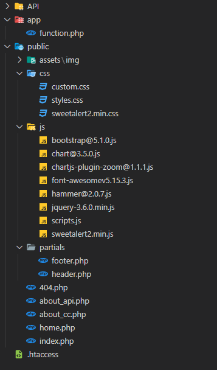
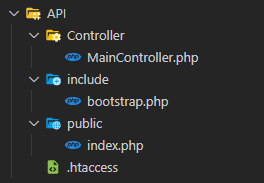

Collatz Conjecture 
==================

The API
-------

-   [Introduction](#intro)
-   [How It Works](#wiw)
-   [Output & Examples](#o&e)
-   [Errors](#errors)
-   [Source Code & Examples](#source)
  
<br>

Introduction <a name="intro"></a>
------------

Hello, I’m Massimo Geloni (alias MMJ) and I’m a web developer (backend
mostly). I developed this website and its related API to practice. This
is a very simple **PHP REST API** working with a single URL and a single
HTTP verb: GET. No authentication is required. The purpose is to provide
a **Collatz Conjecture sequence** from a starting number specified by
the user in the request.

This is meant to be an open API but also an open source free project.
The source code, under MIT Licence, is available here:
**[github.com/MasonMassyJames/CollatzConjecture](https://github.com/MasonMassyJames/CollatzConjecture)**.
Please feel free to use it, partially or wholly, as you need to. A link to the source and the reporting of author name is not required but appreciated. If you
have any advice or correction about it or if you feel this documentation
lacks something, I'll be glad to know:
**[massimo.geloni@gmail.com](mailto:%20massimo.geloni@gmail.com)**.

Note: this application has a limit about the size of the starting number
provided to generate the sequence and this size is less the size of the
greatest number tested by mathematicians to disprove the Collatz
Conjecture. Hence, no number supplied to this API will escape the final
4-\>2-\>1 loop. Having said that, my goal was to create something quite
realistic, even if only "virtually", therefore the limit size of the
starting number can be easly changed and the logic used to build up the
sequence is not "blinded" to just stop when the sequence hit "1" but is
able to find ANY other loop could occur.

<br>

How It Works <a name="wiw"></a>
------------

The single endpoint of this API is

    GET | https://pgxstudio.com/collatzconjecture/API/{startingNumber}/[limit]

Parameters specifications:

| Parameter                            | Description                          |
|--------------------------------------|--------------------------------------|
|     {startingNumber}                 | **Required.** Must be a Natural number greater than zero (positive integer). This is the number the sequence calculation starts from.
|     [limit]                          | **Optional.** Must be a Natural number (positive integer). If zero or no parameter is given, no limit is applied. If a valid number is given, the number sequence length is limited up to that number.                          |

<br>

Output & Examples
-----------------

For any request a JSON formatted reply is provided.

Basing on the request, the response is a JSON with this info (in green
info displayed only if request is valid and no error occurred, in red
info displayed only if request is invalid or error occurred):
                
      {
        "status" : a string with value "ok" or "error" 
        "sequence" : a JSON holding the indexed number sequence 
        "odd" : the number of the odd numbers present in the sequence   
        "even" : the number of the even numbers present in the sequence   
        "error_code" : the code number of the error (list of errors below)  
        "message" : a string message related to the specific error occurred 
      }             
          

### **Example of successful request without limit parameter**
>
>Request:
>
>    GET | https://pgxstudio.com/collatzconjecture/API/6
>
>Response:
>
>```JSON                        
>     {
>        "status":"ok",
>        "sequence":{"0":6,"1":3,"2":10,"3":5,"4":16,"5":8,"6":4,"7":2,"8":1}, 
>        "odd":3,
>        "even":6
>      }
>```            

### **Example of successful request with limit parameter**
>
>Request:
>
>    GET | https://pgxstudio.com/collatzconjecture/API/6/4
>
>Response:
>```JSON           
>      {
>        "status":"ok",
>        "sequence":{"0":6,"1":3,"2":10,"3":5}, 
>        "odd":2,
>        "even":2
>      }
> ```
                      

### **Example of failed request**

>Request:
>
>    GET | https://pgxstudio.com/collatzconjecture/API/string
>
>Response:
>```JSON
>      {
>        "status":"error",
>        "error_code":3, 
>        "message":"ERROR. Starting number must be a positive integer between 1 and 1000000000000."
>      }
> ```

<br>               

Errors<a name="errors"></a>
------

Here's the list of possible errors coming from API

| Error Code | Message                                | Description                    |
|------------|----------------------------------------|--------------------------------|
| 1          |"ERROR. Too many parameters in request."|The GET URL used is passing other parameters besides the starting number and the limit.|
| 2          |"ERROR. Too few parameters in request."|The GET URL used is not passing the starting number.|
| 3          |"ERROR. Starting number must be a positive integer between 1 and [MAX\_STARTING\_NUMBER]"|The starting number parameter is passed but is not a positive integer or it is 0 or it is greater than the maximum number allowed (set in the `API/include/bootstrap.php` and now is set to 1'000'000'000'000).|
| 4          |"ERROR. Limit number be a positive integer."|The limit parameter passed is not a positive integer.|
| 5          |"ERROR. Unknown error. Something went wrong."|Something got f\*cked up somehere and I have no clue :(|

<br>

Source Code & Examples
---------------------

This is meant to be an open API but also an open source free project.
The source code is available at this link. Please feel free to use it,
partially or wholly, as you need to. Any advice or correction about it
will be very appreciated:
**[massimo.geloni@gmail.com](mailto:%20massimo.geloni@gmail.com)**.

### **Project tree**



In the previous image you can see the complete project tree you will
find in the github repo. The application consuming the API is written in
a functional-procedural style, while the API is an Object driven
architecture. The JS client-side logic interpreting JSON and showing
graphs lies in the scripts.js file. The API lies in the the omonym
folder you can see in details in the image below.



So, if you need just the API, all it takes is inside that folder, you
can grab it and put it in your project. The API is built with its own
.htaccess and even if you change the request like

    https://www.yourwebsite.com/something/somethingelse/API

it will work unless you change the name of the API folder. If you plan
to change it just set it accordingly in **API/include/bootstrap.php**
and it will work again.

```PHP
  // Define API folder name (used to ensure correctness
  // of request array no matter the url of the API is)
  define("API_FOLDER", 'API');
```

In this same file you can set the MAX accepted number for the starting
number.

### **Example of a PHP Call to the API**

```PHP             
      function call_CC_API($num, $limit) {

        // Build url: if no limit is set, 
        // append only one parameter (url/$number/[$limit]) 
        $url = BASE_API_URL . $num;
        $url .= $limit ? '/' . $limit : '';

        $curl = curl_init();

        curl_setopt($curl, CURLOPT_URL, $url);
        curl_setopt($curl, CURLOPT_RETURNTRANSFER, 1);

        $result = curl_exec($curl);

        curl_close($curl);

        return $result;

      }
```           

In this function I passed the (previously checked) starting number and
limit provided by the user. Then I built the URL string basing on the
presence of the limit value. The BASE\_API\_URL is a constant defined at
the beginning of the same file (function.php).